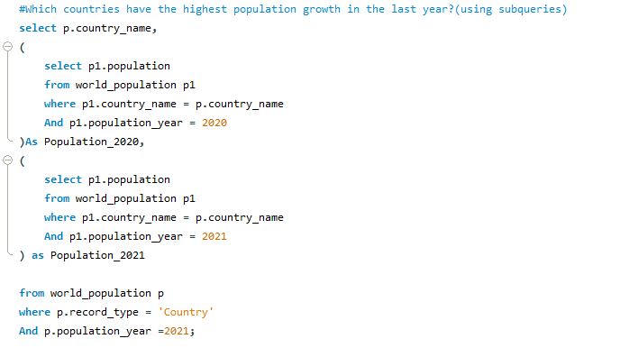
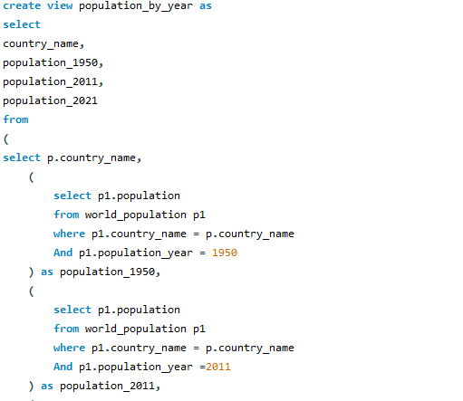
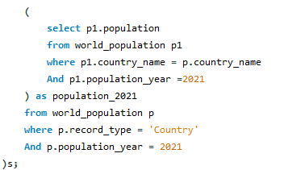
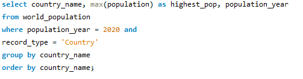
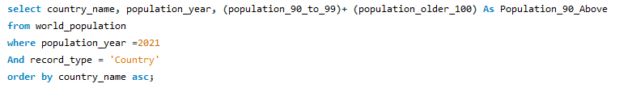

# World Population Analysis (SQL Project)

  

## 📌 Project Overview
This project explores *world population data* using SQL.  
The dataset includes country names, years, total population, and age-group breakdowns — more than *25 columns* in total.  

The main goal was to *clean, transform, and analyze* the dataset to answer real-world business questions around demographics and population growth.  

---

## 🔧 Steps Taken
1. *Database Setup*
   - Created a world_population table in MySQL.  
   - Renamed inconsistent column names for better readability.  
   - Added a record_type column to classify rows as Country, Continent, or Category.  

2. *Data Cleaning & Transformation*
   - Standardized country and region naming.  
   - Assigned proper record types using UPDATE queries.  

3. *Analysis Queries*
   - Built queries to answer population-related business questions.  
   - Created SQL *views* for reusability and cleaner code.  

---

## 📊 Business Questions Answered
- What is the *population of people aged 90+* in each country (latest year)?  
- Which countries had the *highest population growth* last year?  
- Which country experienced the *highest decline*?  
- What are the *top 10 fastest-growing countries* over the last 10 years?  
- Which country has shown the *highest growth since 1950*?  
- How do population trends compare *across continents*?  

---

## 💡 Program Challenges & Solutions
- *Challenge 1:* Comparing population across years was tricky since rows were structured by year.  
  - ✅ Solution: Used *subqueries* to fetch and compare values from different years.  

     

- *Challenge 2:* Similar queries were becoming repetitive and cluttering my script.  
  - ✅ Solution: Created a *SQL view* to simplify future queries and improve reusability.  

   
  
  

---

## 📂 Files in this Repo
- Population_analysis.sql → Full SQL script with cleaning, transformations, and queries.  

---

## Skills Demonstrated
- SQL (MySQL)  
- Data cleaning & transformation  
- Subqueries & Views  
- Population & demographic analysis  
- Query optimization  
   
---

## 🖼 Example Screenshots
Here are a few more visual examples:  

*SQL Queries in Action*  
  

*Population Greater than 90*  
  

---

Feel free to fork this repo or suggest new questions to explore with the dataset!
